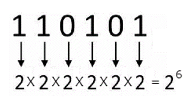
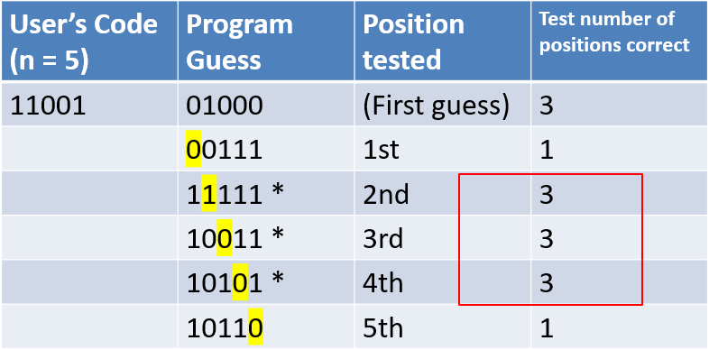
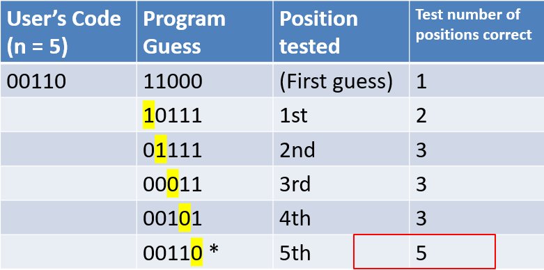
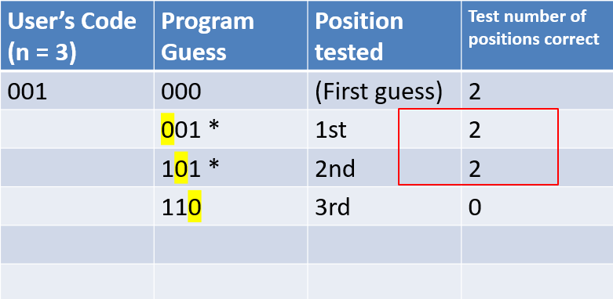

# SecretCodeGuessing
***
Secret Code guessing is a c programming project made in the Fall of 2022 for Dr. Hanna's CS2315 Algorithms class at St. Mary's University of San Antonio

# Table of Contents

1. [Purpose](#purpose)
2. [Introduction](#introduction)
3. [Formula Explained](#formula-explained)
4. [Algorithm](#algorithm)
5. [Formula Examples](#formula-examples)
6. [Computational and Critical Thinking Question](#computational-and-critical-thinking-question)
7. [Lessons Learned](#lessons-learned)
8. [Installation](#installation)


## Purpose

The purpose of this project is that it is a solution to this algorithmic problem:

(From pg. 47 of Levitin and Levitin. Algorithmic Puzzles (C). Oxford University Press, 2011.)
(1)	Have the user input an integer n which will serve as the size for a string of bits (Ex. 11011 for n = 5). Refer to this as a “code.”
(2)	Tell the user to think of their secret code.
(3)	Provide “guesses” of the code by outputting n-bit strings to the user
(4)	For each guess, have the user input how many bits in the guess coincide with the corresponding bits in the secret code ( Ex. Secret Code = 01011; Guess = 11001; User will input 3 because the two strings have the same bits in the second, third, and fifth positions. )
(5)	You should be able to guess any secret n-bit code in no more than n questions. 

## Introduction

(1) User must understand what binary digits are.

Binary code is the most simplistic form of data. It is represented entirely by a binary system of digits consisting of a string of consecutive zeros and ones.
A bit (short for "binary digit") is the smallest unit of measurement used to quantify computer data. It contains a single binary value of 0 or 1.
Bits can also represent truth values, where 0 is false and 1 is true.

Sources:
www.techopedia.com/definition/17052/binary-code 
Bit Definition (techterms.com) 

(2) The next thing to note about this program is how the number of possible codes increases with the size of the bit string. 
For the size of the string n, there are 2^n codes that the user could choose. 
The picture below demonstrates the number of combinations if n = 6.

There are 64 possible combinations for n = 6.


## Formula Explained
There is a formula to determine if a 'spot' is in the user’s secret code
After the first guess is outputted and the number of positions correct are received, the next step is to test each spot and determine if it is one of the number of positions correct. 
Testing each spot consists of keeping its value the same and flipping every other value in the string.
While testing a spot, if it is in the secret code the number of correct positions will be as follows:
	
   n – (number of positions correct first guess) + 1

## Algorithmn
This algorithm is used to identify the correct spots based on the formula 

Create first guess
Receive the  number of positions correct from the user and save
For each spot in the string and while correct spots are not found and while incorrect spots are not found
    For each spot not being tested
       Flip the bit
    Output guess for the spot being tested
    If the new number of positions correct is equal to the formula
       Save the spot as a correct spot
    Else
       Save the spot as an incorrect spot

The first loop will terminate once either all the correct spots are found, all the incorrect spots are found, or the program runs out of guesses

## Formula examples

(1) 


Formula: Test positions correct = n – (positions correct first guess) + 1
Formula Applied: Test positions correct = 5 – 3 + 1 = 3
* = correct spot

(2)

Formula: Test positions correct = n – (positions correct first guess) + 1
Formula Applied: Test positions correct = 5 – 1 + 1 = 5
* = correct spot

(3)

Formula: Test positions correct =  n – (positions correct first guess) + 1
Formula Applied: Test positions correct = 3 – 2 + 1 = 2
* = correct spot

## Computational and Critical Thinking Question
```
int spot = 1;
int correctCount = 0;
int notCorrectCount = 0;

while(spot <= n && notCorrectCount != (n-positions) && correctCount != positions)
{
  -----
 spot++
}
```
 The above code is a sneak peek of the while loop used to iterate through each spot, but stops early if all the correct spots are found or all the incorrect spots are found.
( Remember that for a spot to be considered correct, when it is tested the number of positions correct must be equal to the formula given. )

a. How do we know that all the correct spots are found if it is equal to positions?
b. How do we know that all the incorrect spots are found if it is equal to n-positions?
c. How come we are saving both the number of correct spots and the number of incorrect spots with each iteration, and not just one?

### Answer
a. The variable positions holds the number of spots that were correct for the first guess. If correctCount reaches this number, then that means all the spots that were correct in the first guess have been found.

b. The variable positions holds the number of spots that were correct for the first guess. That means that the number of incorrect spots will be the total number of spots minus those that were correct, or (n-positions).

c. This ensures that the user's secret code is found within n guesses. If we chose to just iterate through every spot, then we would have n+1 total guesses, which would be the first guess plus the tester guess for each n spot. If we chose just to count the correct spots and terminate the loop when they are all found, there is a possibility that all the correct spots are at the end of the code, so they wouldn't be found until every spot is checked, leaving us with n+1 total guesses again. By choosing to also count the incorrect spots, it accounts for scenarios where the correct spots may be hiding at the end of the code as well. When all the incorrect spots are found, we know that the spots remaining must be in the secret code.

## Lessons Learned
Simpler is better!
I originally tried to solve this problem with combinations. I would use the size of the array as n, and the number of positions correct as my k in the formula:             				n!/k!(n-k)!
To try to narrow down the number of possible combinations that the user was using. The problem I had here was that trying to test 2, 3, 4, etc. positions at a time made it much more difficult to determine which spots were actually in the secret code. 

By choosing to test each position 1 at a time, a pattern arose and that is when the formula to determine if a spot was correct:
	test number of positions correct = n-positions + 1
was found.

## Installation
To run a C program from a Git repository using Dev-C++, you need to follow these steps:

**Prerequisites:**

Before you start, ensure that you have the following prerequisites installed on your system:

1. **Dev-C++:** Download and install the Dev-C++ IDE if you haven't already. You can get it from [https://sourceforge.net/projects/orwelldevcpp/](https://sourceforge.net/projects/orwelldevcpp/).

2. **Git:** Make sure Git is installed on your computer. You can download it from [https://git-scm.com/](https://git-scm.com/).

**Installation Instructions:**

1. **Clone the Git Repository:**

   Open a terminal or Git Bash and navigate to the directory where you want to clone the Git repository. Use the `cd` command to change to your desired directory.

   ```bash
   cd path/to/your/directory
   ```

   Clone the Git repository by running the following command, replacing `<repository-url>` with the URL of the Git repository:

   ```bash
   git clone <repository-url>
   ```

   You may need to enter your Git credentials if prompted.

2. **Open the Project in Dev-C++:**

   - Launch the Dev-C++ IDE on your computer.

   - Go to "File" > "Open Project."

   - Navigate to the directory where you cloned the Git repository and select the project file or the `.dev` or `.devp` file associated with the project.

   - Click "Open" to load the project into Dev-C++.

3. **Compile and Run the C Program:**

   - In the Dev-C++ IDE, you will see a list of files in your project, including your C source code file(s).

   - Double-click on the C source code file you want to run to open it in the code editor.

   - Write or modify your C program as needed.

   - Save your changes by going to "File" > "Save" or by pressing `Ctrl + S`.

   - To compile your program, click on the "Execute" menu and select "Compile." Alternatively, press `F9`.

   - If there are no compilation errors, you can run the program by clicking on the "Execute" menu and selecting "Run" or pressing `F10`.

   - The output of your program will be displayed in the Dev-C++ IDE's console window.

Congratulations! You have successfully cloned a Git repository and run a C program using Dev-C++. You can now work on and experiment with the C program in this environment. If you encounter any issues, refer to the troubleshooting section in the previous readme file for guidance.


